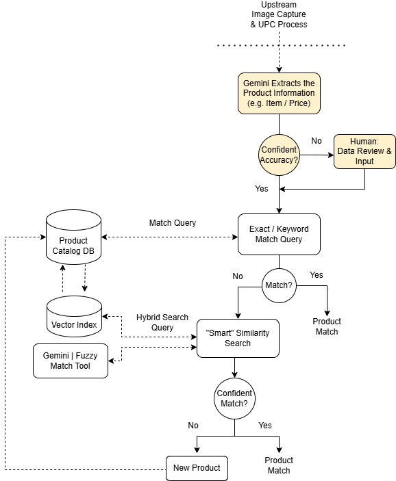

# instore-image-data-extraction

This repository focuses on leveraging Gemini for the extraction and analysis of data from in-store images. It provides a framework for capturing product details to enhance retail analytics (e.g. price comparisons) and to automate downstream tasks (e.g. price updates, new product identification).

## Sample Workflow

This repo focuses on the highlighted areas of the workflow below.

# Getting Started

Explore the Jupyter notebooks to understand the process of in-store image data extraction and analysis.

*   **[01-compscan-gemini-exp.ipynb](./notebooks/01-compscan-gemini-exp.ipynb)**: This notebook serves as an initial exploration into using Gemini for competitive scan (compscan) data extraction. It covers the setup, data loading, and preliminary experiments with Gemini's capabilities to identify and extract relevant information from images.
*   **[02-compscan-analysis.ipynb](./notebooks/02-compscan-analysis.ipynb)**: This notebook focuses on evaluating the Gemini extraction results by comparing them against ground truth labels to calculate accuracy tables. It also performs further analysis to assess statistical signal and confirm performance reliably for various Gemini models.